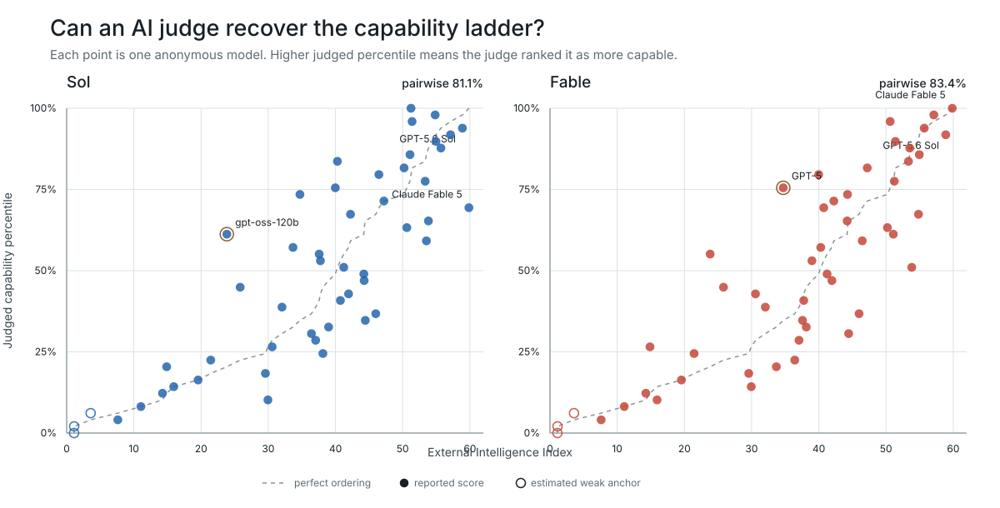
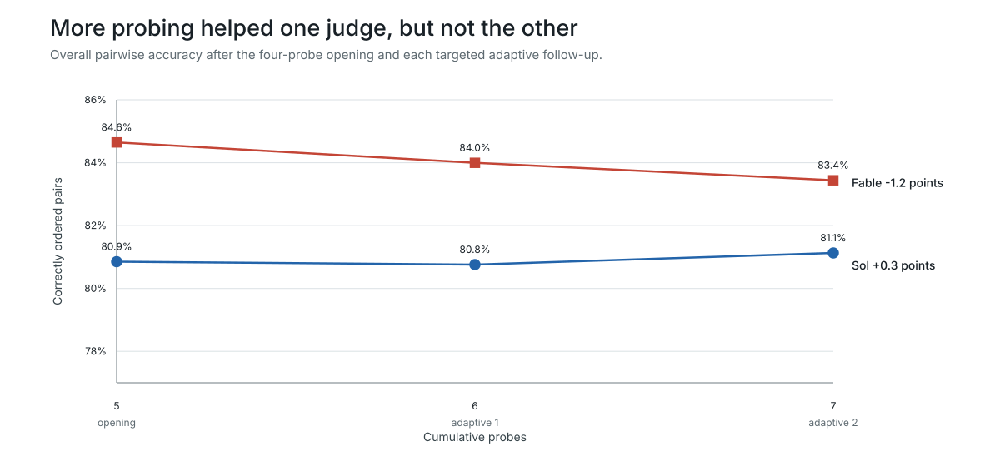
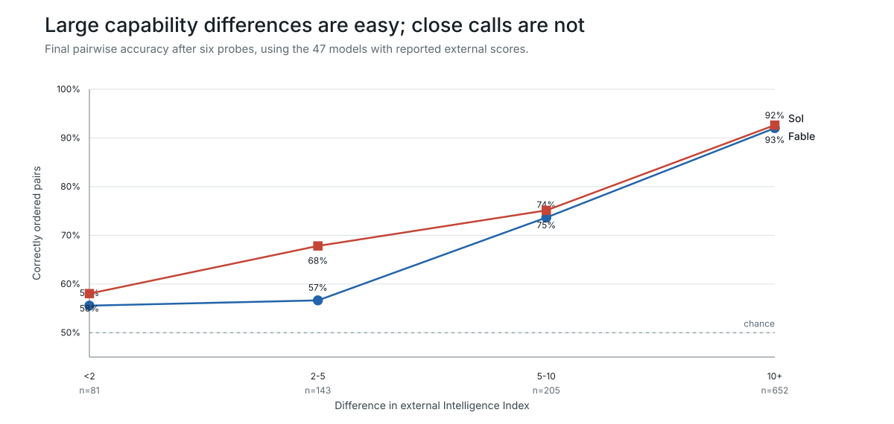

# Five-Probe Catalog Replication

## Question

Does the 50-model catalog result survive a fresh probe battery, and do two
adaptive follow-ups improve the ranking?

## Design

Sol and Fable independently evaluated the same 50 anonymous candidates used in
the first catalog study. Each judge wrote five probes before seeing any answer,
ranked the candidates, and then wrote two common adaptive probes for at most ten
uncertain candidates. The directly reported external-score subset contains 47
models and is the primary analysis set.

Every candidate answer was recovered under the original model settings. The
final runs contain no unavailable answer cells and no model-specific recovery
override. Repair lineage and incremental cost remain visible in the run
metadata.

## Results

| Judge | 5 probes | 6 probes | 7 probes | Old final | Old-new rank tau |
| --- | ---: | ---: | ---: | ---: | ---: |
| Sol | 80.9% | 80.8% | 81.1% | 83.9% | 0.69 |
| Fable | 84.6% | 84.0% | 83.4% | 79.8% | 0.65 |

Values in the probe columns are pairwise accuracy against the external index.
The mean final accuracy changed only from 81.9% to 82.3%, but the judges moved
in opposite directions. The aggregate result is therefore stable while the
judge-by-battery result is not.

The fresh rankings should not be read as precise league tables. Mean top-five
overlap with the earlier run was 60%, and mean old-new Kendall tau was 0.67.
Both fresh judges still exceeded 92% accuracy on pairs separated by at least
ten external-score points. For pairs separated by less than two points, Sol
reached 55.6% and Fable 58.0%.

The adaptive probes did not improve the primary ranking. Sol changed by
`+0.3` percentage points from five to seven probes; Fable changed by `-1.2`
points. The five-probe opening is therefore the clean primary endpoint for this
replication, with later rounds retained as evidence about selective adaptation.

## Figures

The judges recover the broad slope of the external index, with substantial
dispersion among close frontier models.

Additional adaptive evidence is not monotonically beneficial in either run.

Most reliable discrimination comes from model pairs separated by large
external-score gaps.

## Probe Behavior

Both judges detected saturation near the top of the catalog and targeted ten
models per adaptive round. Sol changed domains and requested harder,
adversarially checkable constructions. Fable first retested causal and
calibration weaknesses, then reused that successful structure on an untested
middle band.

Across the two runs, 13 of 14 probes were marked informative by their own
judge. Math, science, reading, planning, and coding were the most common
question families. Sol's adaptive probes broadened the task; Fable's two
adaptive probes deepened an earlier evaluation pattern. Neither strategy
produced a clear aggregate ranking gain in this single replication.

## Cost

Provider-reported spend, including the recorded repair lineage, was `$32.23`
for Sol and `$32.85` for Fable, or `$65.08` total. The earlier two runs cost
`$35.14`.

## Interpretation

The robust result is coarse discrimination: broad capability gaps are reliably
ordered. Fine ordering remains sensitive to the judge and its chosen probe
battery. A fresh fifth opening probe did not make adaptive follow-ups
monotonically useful, so probe count should remain an empirical checkpoint
rather than an assumed measure of evidence quality.

The combined report is
[`runs/report_cards/catalog_ladder50_sol_fable_opening5_20260727/report_card.html`](../runs/report_cards/catalog_ladder50_sol_fable_opening5_20260727/report_card.html).
The direct old-versus-new stability report is
[`runs/report_cards/catalog_ladder50_opening5_stability/report_card.html`](../runs/report_cards/catalog_ladder50_opening5_stability/report_card.html),
with machine-readable results in
[`data/catalog_ladder50_opening5_stability.json`](../data/catalog_ladder50_opening5_stability.json).
